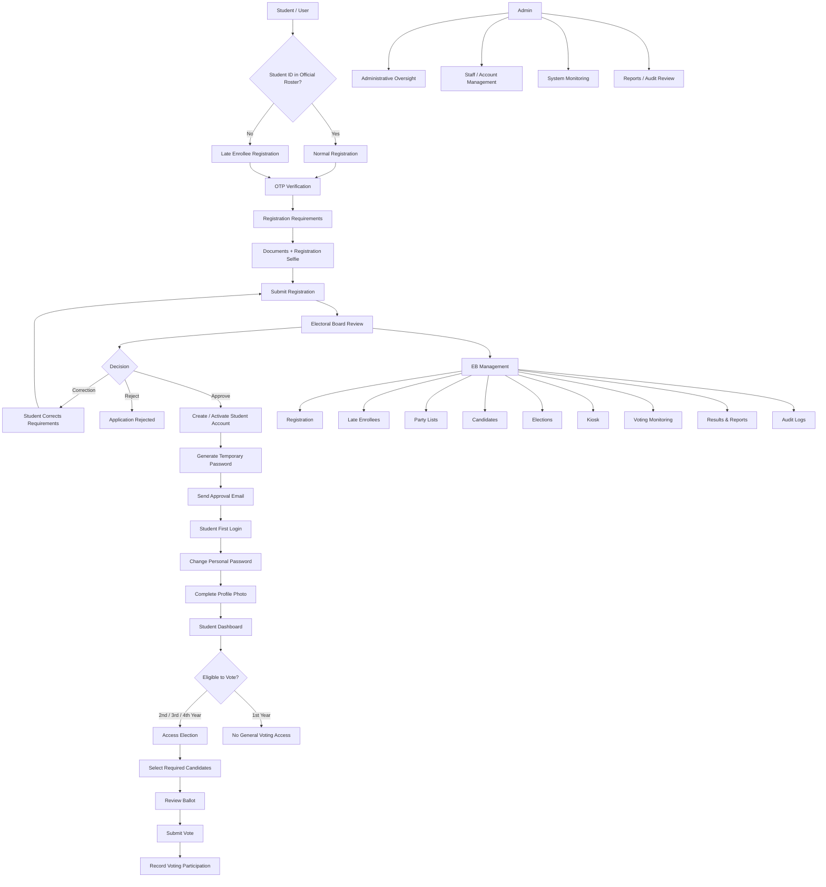

VOTARA --- Online Voting System

Team VOTARA
A modern, secure, and structured web-based student election system.

Project Overview
VOTARA is a department-level online voting system designed to reduce
registration and election-day delays, simplify Electoral Board (EB)
administration, and provide a controlled digital voting workflow for
students, EB members, and administrators.
Brand Guidelines
Brand Identity
VOTARA represents a modern, clean, forward-thinking aesthetic using a
geometric logo mark, readable typography, and a consistent blue-centered
visual identity.
Logo Variations
- Primary Light Version: Blue icon with dark text on light/white
  backgrounds.
- Monochrome Dark Version: Solid black icon and typography on
  light backgrounds.
- Inverted / Dark Mode Version: Bright blue icon and typography on
  dark backgrounds.
Color Palette
  Color                   Hex                     Usage
  Deep                    #1A192B               Dark backgrounds and
                                                  primary text contrast
  White                   #FFFFFF               Light backgrounds and
                                                  negative space
  Serenade                #FFE8D6               Accent backgrounds and
                                                  warm pastel areas
  Blue Screen             #0055FF               Primary brand color,
                                                  CTA elements, logo
                                                  emblem
  G Nova                  #50C8FF               Secondary blue,
                                                  highlights, digital
                                              elements
Typography
- Font: Poppins, sans-serif
- Weights: Regular, Medium, Bold
- Characters: Uppercase A--Z, lowercase a--z, numbers 0--9, and
  common symbols.
Usage Guidelines
- Maintain clear space around the logo.
- Preserve logo proportions and orientation.
- Maintain strong contrast.
- Do not alter the default logo colors without a design requirement.
System Roles
  Role                                Responsibilities
  Student / User                  Registration, account setup,
                                      password change, profile photo,
                                      voting
  Electoral Board                 Registration, late enrollee, party
                                      list, candidate, election, kiosk,
                                      monitoring, results, reports, audit
  Admin                           System-level administration,
                                      staff/account oversight,
                                  monitoring, reports, audit review
Overall Process

Electoral Board Workflow
Electoral Board
 ├── Registration Management
 ├── Late Enrollee Management
 ├── Party List Management
 ├── Candidate Management
 ├── Election Management
 ├── Kiosk Management
 ├── Voting Monitoring
 ├── Results & Reports
 ├── Audit Logs
 └── Settings
Late Enrollee Workflow
Student ID Not Found
        ↓
Late Enrollee Registration
        ↓
Full Name + Year Level
        ↓
School ID Front + Back
        ↓
Registration Form
        ↓
Registration Selfie
        ↓
EB Review
   ┌────┼────────────┐
Approve Reject   Correction
   ↓       ↓          ↓
Create    Reason   Student Corrects
Student    ↓          ↓
Account  Finished   Resubmit
   ↓
Temporary Password
   ↓
Approval Email
   ↓
First Login
   ↓
Change Password
   ↓
Profile Photo
   ↓
Dashboard
When a late enrollee is approved, the system creates the student record
if it does not already exist, creates/activates the student account,
generates a temporary password, sends the approval email, and requires
password change and profile completion before dashboard access.
Election Rules
General year-level representative positions apply only to 2nd Year,
3rd Year, and 4th Year.
  Year       General Voting   Representative
  1st Year   No               No general 1st Year Representative
  2nd Year   Yes              2nd Year Representative
  3rd Year   Yes              3rd Year Representative
  4th Year   Yes              4th Year Representative
Final Positions
1. President
2. Vice President
3. Secretary
4. Ass. Secretary
5. Treasurer
6. Ass. Treasurer
7. Auditor
8. Business Manager
9. Public Information Officer
10. Sergeant at Arms
11. 2nd Year Representative
12. 3rd Year Representative
13. 4th Year Representative
Student Authentication Flow
Temporary Password
       ↓
Student Login
       ↓
Force Personal Password Change
       ↓
Take / Upload Profile Photo
       ↓
Student Dashboard
VOTARA uses JWT authentication, role checks, active-account validation,
bcrypt password hashing, OTP verification, and protected API endpoints.
Kiosk Management
Kiosk Management is a temporary software session operated by an EB
member. It does not require a dedicated physical kiosk device.
A kiosk session records: - Session ID - Election ID - EB operator -
Session status - Start/end time - Last activity - Number of students
served - Creation/update timestamps
EB Login
   ↓
Kiosk Management
   ↓
Select Election
   ↓
Start Temporary Session
   ↓
Serve Eligible Students
   ↓
Track Activity
   ↓
Close Session
Kiosk sessions track operational activity rather than student ballot
choices.
Database / ERD
VOTARA uses Supabase PostgreSQL.
Main Tables
  Table                         Purpose
  students                    Official student roster
  student_accounts            Student authentication/account data
  staff_users                 EB and Admin accounts
  registration_applications   Registration applications
  registration_documents      Submitted registration requirements
  identity_verifications      Identity/selfie verification
  otp_codes                   OTP records
  notifications               Student notifications
  elections                   Election configuration
  election_year_levels        Participating year levels
  positions                   Election positions
  position_year_levels        Position eligibility
  candidates                  Election candidates
  party_lists                 Party list records
  vote_participations         Student voting participation
  ballots                     Submitted ballots
  ballot_votes                Candidate selections
  audit_logs                  EB/Admin activity records
Relationship Overview
elections 1:M election_year_levels
elections 1:M positions
positions 1:M position_year_levels
positions 1:M candidates
elections 1:M party_lists
elections 1:M vote_participations
elections 1:M ballots
ballots 1:M ballot_votes
candidates 1:M ballot_votes
students 1:M vote_participations
students 1:M candidates
registration_applications 1:M registration_documents
registration_applications 1:M identity_verifications
students 1:1 student_accounts
staff_users 1:M audit_logs
Technology Stack
Frontend
- React.js
- Vite
- React Router
- Axios
- React Icons
- Poppins
- Responsive CSS/UI
Backend
- Node.js
- Express.js
- JWT / jsonwebtoken
- bcryptjs
- dotenv
- cors
- express-validator
- Nodemon
Database & Storage
- Supabase
- PostgreSQL
- Supabase Storage
Email
- Gmail email delivery through the configured server email service
- Approval and registration-related email notifications
Development Tools
- Visual Studio Code
- Git
- GitHub
- Supabase Dashboard
- Browser Developer Tools
- Postman
- npm
- PowerShell / Windows Terminal
html5-qrcode exists in the project's dependency history, but
QR-based voting/verification is not part of the finalized VOTARA
scope.

Project Structure
VOTARA/
├── client/
│   └── src/
│       ├── components/
│       ├── pages/
│       │   ├── public/
│       │   ├── student/
│       │   ├── electoralBoard/
│       │   └── admin/
│       ├── services/
│       ├── utils/
│       ├── App.jsx
│       └── main.jsx
├── server/
│   ├── src/
│   │   ├── config/
│   │   ├── controllers/
│   │   ├── routes/
│   │   ├── services/
│   │   └── middleware/
│   ├── server.js
│   └── package.json
├── .gitignore
└── README.md
Development Status
Estimated Overall Progress: ~80%
This is a practical development estimate rather than a formal
software-completion measurement.
Completed / Functional
- VOTARA branding and UI foundation
- Landing/navigation
- Student registration
- OTP verification
- Registration requirements
- Document upload
- Registration selfie
- Registration Management
- Late Enrollee Management
- Late enrollee approval/account creation
- Approval email workflow
- Student authentication
- Password-change flow
- Profile-photo requirement
- Party List Management
- Candidate Management
- Election Management
- Year-level configuration
- Voting Monitoring
- Results & Reports
- Audit Logs interface
- Settings interface
- Supabase/PostgreSQL integration
- JWT authentication
- bcrypt password hashing
Remaining / Integration
- Kiosk Management
- Kiosk database/session integration
- Full end-to-end testing
- Comprehensive security testing
- Automatic audit logging across every module
- Final UI/UX polish
- Production deployment verification
- Final documentation and testing evidence
Development Roadmap
Foundation                         ████████████████████ 100%
Authentication & Registration     ████████████████████ 100%
EB Management                     ████████████████████ 100%
Voting & Results                  ██████████████████░░  90%
Kiosk                             ██████░░░░░░░░░░░░░░  30%
Testing & Integration             ██████░░░░░░░░░░░░░░  30%

Overall                           ████████████████░░░░ ~80%
Finalized Scope Decisions
- No QR-based voting or verification.
- No separate In-Person Verification module.
- Candidate management remains under the Electoral Board.
- Two-person approval is reserved for appropriate election
  opening/closing controls.
- General year representatives apply only to 2nd, 3rd, and 4th Year.
- 1st Year has no general year representative position.
- Late enrollees can be added to the official student roster through
  the EB approval workflow.
Environment Variables
Never commit real secrets to GitHub.
SUPABASE_URL=
SUPABASE_SECRET_KEY=
JWT_SECRET=
EMAIL_HOST=
EMAIL_PORT=
EMAIL_USER=
EMAIL_PASS=
DEFAULT_STUDENT_PASSWORD=
PORT=5000
Keep .env excluded through .gitignore.
Local Development
Backend
cd server
npm install
npm run dev
Default backend:
http://localhost:5000
Frontend
cd client
npm install
npm run dev
Default Vite development server:
http://localhost:5173
Git / GitHub Workflow
git pull origin main
git status
git add .
git commit -m "Describe your changes"
git push origin <your-branch>
Recommended feature branches include:
feature/student-registration
feature/late-enrollee
feature/election-management
feature/kiosk
feature/admin
feature/reports
Test locally before merging changes into main.
Testing Strategy
Student
- Registration and OTP
- Registration requirements
- Selfie capture
- Normal approval
- Late enrollee approval/rejection/correction
- Temporary password
- Forced password change
- Profile photo
- Year-level eligibility
- Vote submission
- Duplicate-vote prevention
Electoral Board
- Authentication
- Registration Management
- Late Enrollee Management
- Party Lists
- Candidates
- Elections
- Kiosk
- Voting Monitoring
- Results & Reports
- Audit Logs
- Settings
Admin
- Authentication
- Staff/account management
- Administrative oversight
- Reports
- Audit review
Team VOTARA
Team VOTARA is the development team behind the system.
Suggested responsibility areas: - Frontend Development - Backend
Development - Database Development - Authentication & Security -
Election Module Development - Voting & Results - Testing & Quality
Assurance - UI/UX & Branding - Documentation
Individual member names and final assignments can be added here.
Next Development Priorities
1. Kiosk Management
2. Kiosk database/session integration
3. Student → EB → Election end-to-end testing
4. Security and permission testing
5. Automatic audit logging completion
6. UI/UX final polish
7. Production deployment testing
8. Final documentation
9. VOTARA release
💙 VOTARA
Modernizing Student Elections Through a Clean, Secure, and Structured
Digital Voting Experience.
Built with React, Node.js, Express, Supabase, PostgreSQL, JWT, bcrypt,
and Team VOTARA.